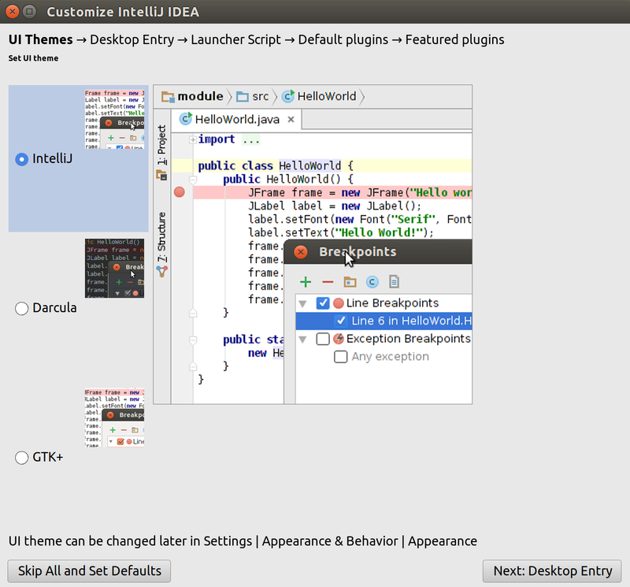
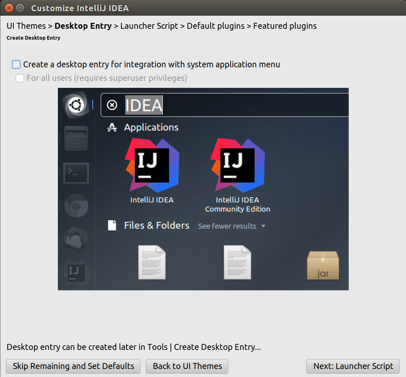
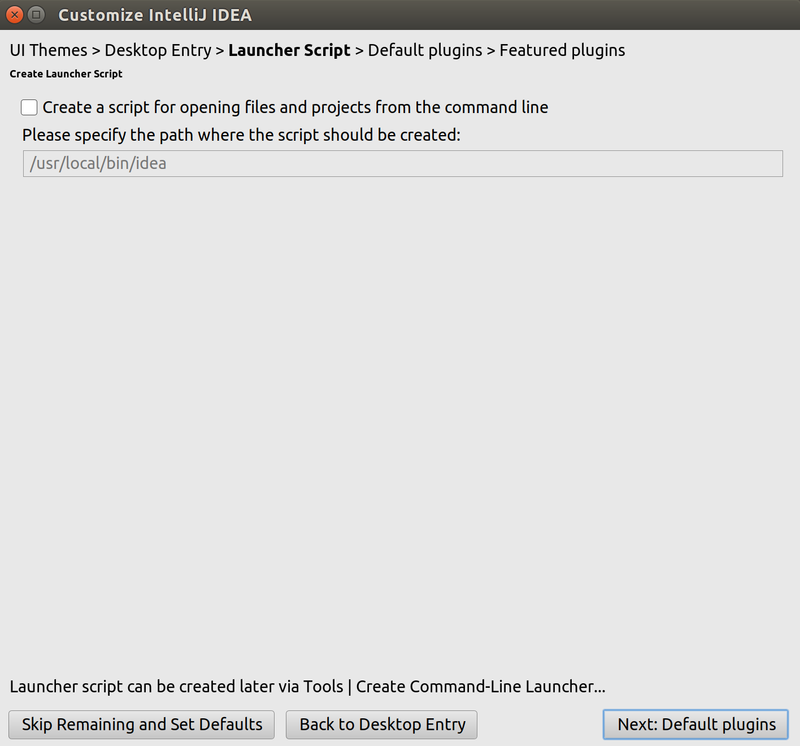
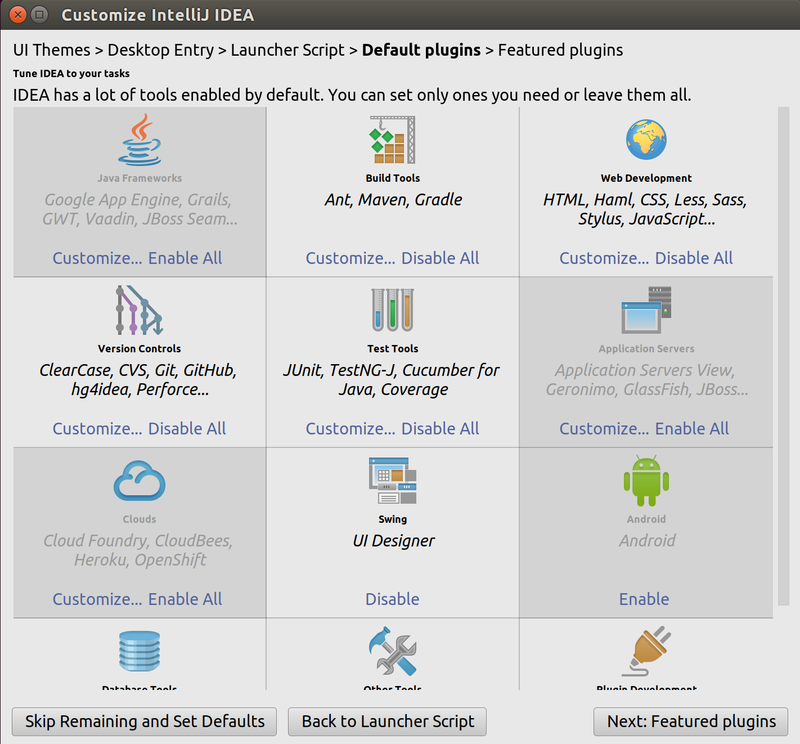
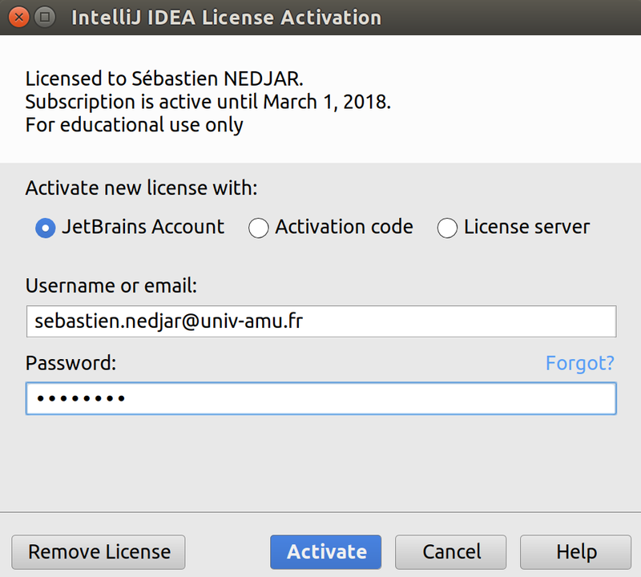
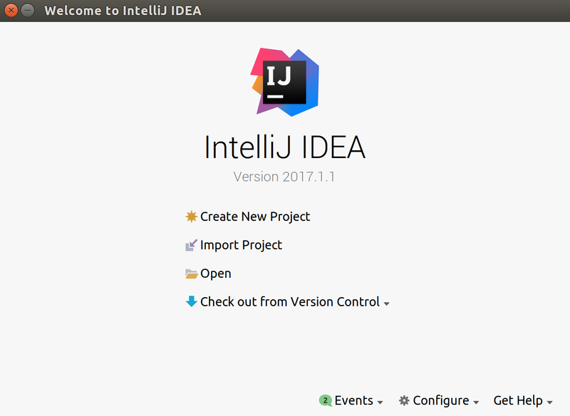
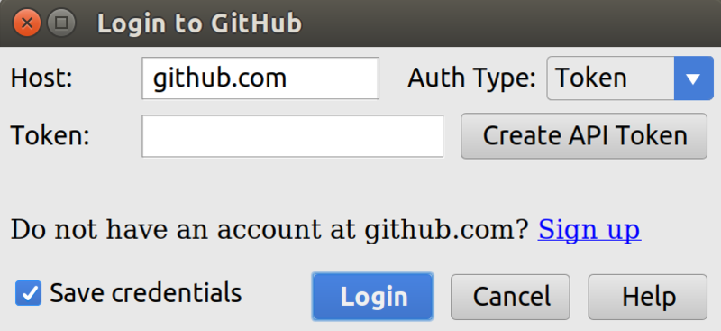
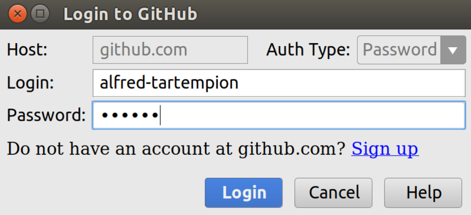
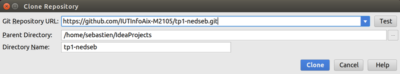

#  Introduction aux IHM en Java 

### IUT d’Aix-Marseille – Département Informatique Aix-en-Provence

* **Cours:** [M2105](http://cache.media.enseignementsup-recherche.gouv.fr/file/25/09/7/PPN_INFORMATIQUE_256097.pdf)
* **Responsable:** [Sébastien NEDJAR](mailto:sebastien.nedjar@univ-amu.fr)
* **Enseignants:** [Sébastien NEDJAR](mailto:sebastien.nedjar@univ-amu.fr), [Cyril Pain-Barre](mailto:cyril.pain-barre@univ-amu.fr)
* **Besoin d'aide ?**
    * La page [Piazza de ce cours](https://piazza.com/univ-amu.fr/spring2017/m2105/home).
    * Consulter et/ou créér des [issues](https://github.com/IUTInfoAix-M2105/tp1/issues).
    * [Email](mailto:sebastien.nedjar@univ-amu.fr) pour une question d'ordre privée, ou pour convenir d'un rendez-vous physique.

## TP 1 : Découverte de l'environnement de travail, des outils et premiers programmes en Java [](https://travis-ci.org/IUTInfoAix-M2105/tp1)

L'objectif premier de ce TP est de vous familiariser avec tous les nouveaux outils qui seront mis en oeuvre pendant ce cours. En plus de la réalisation d'IHM, ces TP seront la première occasion de se confronter à la gestion de version, au test unitaire et à des outils de gestion de cycle de vie logiciel comme Maven.

### Découverte de Git et préparation de l'environnement

Comme vous allez le découvrir, pour conserver vos réalisations et permettre à votre enseignant de suivre votre avancement vous allez apprendre à versionner votre travail sur [github](https://github.com/). Pendant ce module, vous allez principalement écrire du code pour vous-même. Comme vous le verrez plus tard ça sera principalement sur les projets à plusieurs que [Git](https://git-scm.com/) offrira sa tout son potentiel.

#### Création d'un compte Github

Rendez-vous sur la page d'accueil de [github](https://github.com/) :


Dans le coin supérieur droit cliquer sur "Sign Up". Dans la page qui apparaît, inscrivez votre nom d'utilisateur (il doit être composé de votre prénom et de votre nom séparé par le caractère '-'). 
Dans le champs "Email Adress" mettre votre adresse universitaire (important pour bénéficier des avantages liés à votre statut d'étudiant). 


Une fois le mot de passe renseigné cliquer sur le bouton "Create Account". Sur l'écran suivant, vous n'avez rien à changer et pouvez directement cliquer sur "Continue".


Le troisième et dernier écran d'enregistrement vous demande des informations sur votre profil. Indiquer principalement que vous êtes un étudiant et que vous comptez utiliser GitHub pour des projets étudiants.


Une fois ces informations renseignées vous pouvez cliquer sur "Submit" pour définitivement créer votre compte.


Ne pas oublier de valider votre adresse email en allant cliquer sur le lien reçu dans l'ENT.

#### Paramétrage de votre compte GitHub

Maintenant que votre compte est créé, il faut personnaliser votre profil. GitHub, en plus de vous fournir un moyen simple 
et efficace de conserver votre code en ligne, est aussi un réseau social de développeur. Pour que votre profil puisse 
être valorisé un jour dans votre carrière pro, vous devez correctement renseigner vos informations (de manière annexe, 
ça facilitera la vie de vos enseignants quand ils essayent de savoir qui contribue vraiment au projet tutoré).

Pour ce faire, cliquer en haut à droite de la fenêtre sur l’icône qui représente votre avatar par défaut et aller sur "Your profile"  :


Vous arrivez sur votre profil public (ce qui est visible quand on cherche votre nom) :


Cliquer sur le bouton "Edit profile" pour arriver sur le formulaire suivant :


Comme dans l'image précédente, renseignez correctement votre nom, prénom, votre localisation et éventuellement votre photo.

#### Demande du "Student Pack"

Pour terminer la configuration de votre compte, il vous faut demander la remise académique vous permettant de bénéficier 
de dépôts privés et de nombreux autres avantages. Pour ce faire, il faut vous rendre sur la page suivante : https://education.github.com/pack


Cliquer sur le bouton "Get your pack" et certifiez que vous êtes bien un étudiant de plus de 13 ans : 


Vérifiez les informations vous concernant (Nom, Email et École principalement)


Validez le formulaire pour terminer cette demande. Généralement la validation de la demande intervient dans l'heure mais 
il peut arriver que ça puisse prendre plus de temps donc pas d'inquiétude.
 


#### Configuration locale de Git

Pour commencer avec Git, nous utilisons directement la version en ligne de commande. Comme vous les verrez rapidement, 
il existe une  pléthore d'outils pour faciliter l'utilisation de Git mais pour s'en servir, il vaut mieux comprendre les 
commandes sous-jacentes.

La première chose à faire avant d'utiliser Git est de correctement le configurer. Cette étape en pratique peut prendre 
du temps mais nous allons simplifier la chose en téléchargeant deux fichiers : 

```sh
wget https://raw.githubusercontent.com/IUTInfoAix-M2105/git_config/master/gitconfig -O ~/.gitconfig
wget https://raw.githubusercontent.com/IUTInfoAix-M2105/git_config/master/githelpers -O ~/.githelpers
```

Ouvrez le fichier `~/.gitconfig` avec votre éditeur favori et renseignez votre nom, prénom et email dans la 
section `[user]`.
```
# Personnalisez les champs ci-dessous!
[user]
username = ChangeMe
name = Change Me
email = change-me@example.com

...

```
Les lignes précédentes doivent donc être modifiées de la sorte :

```
# Personnalisez les champs ci-dessous!
[user]
username = alfred-tartempion
name = Alfred Tartempion
email = alfred.tartempion@etu.univ-amu.fr

...

```

#### Prise en main de Git

Pour continuer à prendre en main Git et GitHub, vous allez suivre un tutoriel interactif vous permettant de découvrir 
l'une après l'autre, les possibilités de ces outils. 

Ce tutoriel prend la forme d'une application de bureau appelée **[Git-It](https://github.com/jlord/git-it-electron)**. 
Cette application est multi-plateforme et pourra donc être utilisée indifférement sur les ordinateurs du département ou 
le vôtre. Elle contient des défis pour l'apprentissage, en utilisant vraiment Git et GitHub, pas des émulateurs. 
Vous apprendrez la géniale ligne de commande (et pas si effrayante) et GitHub, ce qui signifie que lorsque 
vous terminerez tous les défis, vous aurez de vrais dépôts sur votre compte GitHub et vos carrés verts comme les grands 
sur votre tableau de contribution.

Nous avons fait une pull request à l'auteur de ce logiciel pour le traduire, si vous avez de la chance, elle sera intégrée 
au moment de vos TP.

Pour l'installer, rendez-vous sur la page suivante : 

https://github.com/jlord/git-it-electron/releases/latest

Télécharger le fichier **"Git-it-Linux-x64.zip"** , le décompacter dans votre répertoire `net-home` et lancer l'exécutable `Git-it`.

Ceci peut aussi se faire en ligne de commande de la manière suivante : 
```sh
cd ~/net-home/
curl -sOL $(curl -s https://api.github.com/repos/jlord/git-it-electron/releases/latest| \
grep -e "\"browser_download_url\": \".*Git-it-Linux-x64.zip\""| \
sed "s/\"browser_download_url\": \"\(.*Git-it-Linux-x64.zip\)\"/\1/")
unzip Git-it-Linux-x64.zip
Git-it-Linux-x64/Git-it
```

Si disponible à l'instant où vous faites le TP, passez l'interface en Français en cliquant en haut à gauche. La première 
étape du tutoriel peut être passée car vous l'avez déjà réalisée dans la précédente étape du TP.

#### Création de votre fork du TP1

Maintenant que vous connaissez les bases de Git, vous allez pouvoir commencer à travailler sur vos TP. Comme vous allez 
le découvrir le rendu, l'évaluation et le suivi de votre travail passeront par GitHub. La première chose que vous allez 
donc faire est de créer un fork d'un dépôt. Pour ce faire, rendez-vous sur le lien suivant : 

[https://classroom.github.com/assignment-invitations/be2e508aa8f5fd632d0a9f2c30e3aaba](https://classroom.github.com/assignment-invitations/be2e508aa8f5fd632d0a9f2c30e3aaba) 

GitHub va vous créer un dépôt contenant un fork du dépôt 'IUTInfoAix-m2105/tp1' et s'appellant 'IUTInfoAix-m2105/tp1-votreUsername'. 
Vous apparaîtrez automatiquement comme contributeur de ce projet pour y pousser votre travail. Sachez qu'un robot 
récupérera automatiquement votre code après chaque *push* pour vérifier que les tests passent et calculer en même temps 
votre taux d'accomplissement du TP.

#### Visualiser la branche courante

Histoire de visualiser plus facilement sur quelle branche vous êtes, modifiez votre prompt bash afin qu'il affiche la
branche courante.

Éditez le fichier `~/net-home/.bash_profile` (ou `~/.bash_profile`) et ajoutez les lignes suivantes:

```sh
parse_git_dirty (){
  [[ $(git status 2> /dev/null | tail -n1) != "nothing to commit (working directory clean)" ]] && echo "*"
}
```
ou
```sh
parse_git_dirty (){
  [[ $(git status 2> /dev/null | tail -n1) != "rien à valider, la copie de travail est propre" ]] && echo "*"
}
```
selon la langue utilisée, puis :

```sh
parse_git_branch () {
  git branch --no-color 2> /dev/null | sed -e '/^[^*]/d' -e "s/^..\(.*\)/(\1$(parse_git_dirty))/"
}

# Prompt simple pour afficher la branche git courante
#PS1="\[\e]0;\u@\h: \w\a\]${debian_chroot:+($debian_chroot)}\[\033[01;32m\]\u@\h\[\033[00m\]"
PS1="\[\033[01;34m\]\w\[\033[00m\]" 
PS1="$PS1 \[\033[01;31m\]\$(parse_git_branch)\[\033[00m\]"
PS1="$PS1\$ "
```

Tapez `source ~/.bash_profile` pour charger la nouvelle configuration. Votre prompt devrait ressembler à cela:

```sh
~/net-home/tpIHM/tp1 (master)$
```

S'il y a des modifications pas encore versionnées, le nom de la branche courante sera suivi du caractère '*'.

### Découverte et prise en main de l'IDE

Pendant les TP, les enseignants utiliseront comme environnement de développement intégré 
**[IntelliJ IDEA](https://www.jetbrains.com/idea/)** de chez **[JetBrains](https://www.jetbrains.com)**. Cet IDE 
spécialisé dans Java est celui qui aujourd'hui possède la meilleure intégration native d'outils comme Git, GitHub et Maven. 
Il devrait donc vous faciliter la vie au quotidien dans la réalisation de vos TP. Bien évidement, rien ne vous empêche 
d'en utiliser un autre mais attention dans ce cas là, vos enseignants attendront une totale autonomie vis à vis des 
problèmes de prise en main de votre IDE.

IntelliJ IDEA possède deux versions, la première dite *'communautaire'* est totalement open source et peut être utilisée 
gratuitement par n'importe qui et la seconde dite *'ultimate'* qui est plus riche en fonctionnalité et qui n'est pas 
gratuite pour les individus lambda. Par chance, en tant qu'étudiant dans une université française, vous avez la 
possibilité de pouvoir bénéficier d'une licence pour tous les produits JetBrains. Pour bénéficier de cette remise, il 
vous suffit de remplir [ce formulaire](https://www.jetbrains.com/shop/eform/students).

Quelques minutes après, vous recevrez un email de confirmation suivi d'un second email d'activation ou vous devrez accepter 
les conditions d'utilisation et choisir un nom d'utilisateur et un mot de passe. Conservez précieusement ces 
informations dans un coin identifié de votre cerveau car c'est grâce à elle que vous pourrez importer votre licence 
chez vous et dans les salles de TP.

#### Lancement de l'IDE

Allez dans le Menu 'Application' et ouvrir 'IntelliJ IDEA' dans la section programmation.

Après le chargement, vous devriez tomber sur une première fenêtre vous proposant d'importer vos paramètres.


Laissez sur 'Do not import settings' et cliquez sur 'OK'. À partir de là vous allez personnaliser votre installation 
pour qu'elle corresponde à vos besoins.

Sur la première fenêtre de personnalisation, vous devez choisir l’apparence de votre IDE. Ici rien de fondamental, vous 
pouvez choisir l'option que vous voulez. 



Les deux écrans suivants sont plutôt destinés à une installation sur une machine personnelle. À l'IUT vous pouvez laisser 
les options par défaut et passer à la suite.




Les deux écrans suivants vous permettent de choisir les plugins que vous allez activer. De manière générale, il vaut 
mieux en activer le moins possible pour éviter les mauvaises surprises.




Voici la configuration que je vous conseille :
- **Java Framworks :** Aucun
- **Build Tools :** Maven
- **Web Development :** Tous
- **Versions Controls :** Git et Github
- **Test Tools :** Tous
- **Application Servers :** Aucun
- **Clouds :** Aucun
- **UI Designer :** Activé
- **Android :** Désactivé
- **Database Tools :** Choix par défaut
- **Other Tools :** Tous
- **Plugin Development :** Désactivé

Il ne reste plus qu'à saisir vos données de connexion pour terminer le paramétrage de votre IDE.



#### Import du projet dans l'IDE

Pour pouvoir maintenant travailler sur votre TP, il vous faut cloner votre dépôt GitHub et l'importer dans 
l'IDE.



Pour ce faire cliquez sur 'Check out from Version Control' puis sur 'GitHub'. Vous allez arriver sur 
la fenêtre de connexion à GitHub.



Cliquez sur 'Create API Token' et sur la fenêtre suivante entrez vos identifiants GitHub et cliquez sur 'Login'. 



Vous revenez sur la fenêtre précédente où vous pouvez aussi cliquer sur 'Login'.


À partir de là, vous voyez apparaître la fenêtre 'Clone Repository' dans laquelle vous allez pouvoir choisir le dépôt 
distant que vous allez cloner et ouvrir. Ici sélectionnez votre fork du TP1 qui devrait avoir un nom de la 
forme 'IUTInfoAix-m2105/tp1-votreUsername'. Mémorisez bien le dossier dans lequel vous clonez votre projet. Vous aurez besoin d'y accéder par la suite en ligne de commande pour soumettre vos changement et les pousser en ligne. 



*ItelliJ IDEA* va détecter que votre projet possède un fichier `pom.xml`, il vous suffit de cliquer sur 'Yes' pour 
terminer l'import de votre projet et commencer à travailler. 


#### Découverte de l'IDE
Lorsque vous ouvrez votre projet, vous arrivez sur une fenêtre comme celle-ci :


Cliquez sur l’icône en bas à gauche et sélectionnez 'Project' pour avoir la vue de votre projet


Dans cette vue, vous pouvez voir les différents dossiers de votre projet. Pour le TP, vous travaillerez 
principalement dans deux d'entre eux : 

- `src/main/java/fr/univ_amu/iut/` : Qui contiendra l'ensemble du code applicatif (le code des exercices).
- `src/test/java/fr/univ_amu/iut/` : Qui contient les classes de test associées (le code vous aidant à vérifier votre solution).

La première fois que vous lancez IntelliJ IDEA, il faut indiquer quel JDK utiliser. Pour ce faire, ouvrez n'importe quel 
fichier Java de votre projet. En haut de l'éditeur, vous devriez avoir un bandeau jaune vous indiquant l'absence de JDK.


Cliquez sur `Setup SDK` pour choisir le JDK à utiliser.


Cliquez sur `Configure ...` puis sur l'écran suivant cliquer sur le plus vert en haut à gauche :


Choisir le dossier contenant Java 8 :


Validez trois fois jusqu'à revenir à l'éditeur. Maintenant votre projet est complètement configuré vous allez pouvoir 
commencer à prendre en main l'IDE.

### Workflow

Maintenant que vous savez utiliser Git en ligne de commande, que vous avez forké, importé et ouvert le TP dans votre IDE, 
vous êtes en capacité de travailler sur vos exercices. Pour vous faire découvrir le Test Driven Development (TDD), nous 
allons vous proposer de suivre un workflow particulier pour résoudre vos exercices progressivement et en consolidant 
progressivement un filet de sécurité qui vérifiera que votre code continue à bien faire ce qu'il doit.

Le TDD est une méthode de conception émergente c'est-à-dire que la conception apparaît au fur et à mesure du 
développement en encourageant une meilleure compréhension du problème en commençant à écrire les tests avant le code 
applicatif. Pour le développeur, les tests vont constituer une spécification technique exécutable et vérifiable à tout 
moment. Ainsi en rajoutant des tests, le développeur converge progressivement à la fois vers une spécification plus fine 
et un code fonctionnel associé.

Le workflow du TDD est souvent décrit par le triptyque "RED, GREEN, REFACTOR".


Le workflow que vous allez devoir suivre va reprendre la même structure, mis à part qu'au début, les tests vous sont 
donnés pour vous faire découvrir cette méthode sans trop de douleur.

#### Étapes du cycle principal

1. **RED :** Dans cette étape, vous devez activer un test en enlevant le `@Ignore` devant la méthode de test (ou en la décommentant). Une fois 
le test activé, vous devez le lancer pour vérifier qu'il échoue. Un test qui n'échoue jamais ne teste rien donc il ne 
sert à rien.

1. **GREEN :** Ici vous devez écrire le moins de code possible pour faire passer le test en question. Quand vous pensez 
avoir terminé, vous relancez le test en question pour vérifier que le code est juste. Si tel est le cas, vous lancez tous 
les autres tests pour vous assurer que votre implémentation n'a rien cassé.

1. **REFACTOR :** Maintenant que votre couverture de test est au vert, vous pouvez transformer votre code pour le nettoyer, 
le restructurer et l'améliorer sans en changer le comportement. Pendant cette étape, les tests doivent être continuellement 
au vert. Ils jouent le rôle de filet de sécurité pour éviter l'introduction d'une régression dans le code. Quand tout 
est terminé vous pouvez redémarrer le cycle avec un prochain test.

À chaque fin de cycle, vous devez soumettre votre travail sur votre dépôt Git local et le pousser sur votre fork sur 
GitHub. Vous terminez un exercice lorsque tous les tests y sont activés et passent sur votre dépôt distant.

#### Exécution des tests

Pour exécuter vos tests, vous avez deux options, la première est d'utiliser l'IDE en ouvrant la classe de test et en 
cliquant dans la marge de l'éditeur sur le bouton .

Le résultat de l’exécution s'affiche en bas de la fenêtre de l'IDE. Les tests ayant réussi sont affiché en vert et ceux 
ayant échoué sont en rouge. Pour connaître la cause d'un échec, vous pouvez cliquer sur le nom de la méthode de test.

La seconde manière est d'utiliser la ligne de commande directement. Avec cette méthode, vous ne pouvez pas choisir 
individuellement la classe de test à lancer. Tous les tests sont exécutés en séquence l'un après l'autre. Cette méthode 
est donc à préférer quand vous voulez vérifier tout votre code, par exemple avant de faire un *push* sur votre fork GitHub.

Pour utiliser cette méthode, il vous suffit de vous rendre dans le dossier de votre projet et de lancer la 
commande `mvn test` :

```
~/net-home/tpIHM/tp1-VotreUsername (master*)$ mvn test
[INFO] Scanning for projects...
[INFO]                                                                         
[INFO] ------------------------------------------------------------------------
[INFO] Building Tp 1 1.0-SNAPSHOT
[INFO] ------------------------------------------------------------------------
[INFO] 
[INFO] --- maven-resources-plugin:2.6:resources (default-resources) @ tp1 ---
[INFO] Copying 34 resources
[INFO] 
[INFO] --- maven-compiler-plugin:3.1:compile (default-compile) @ tp1 ---
[INFO] Changes detected - recompiling the module!
[INFO] Compiling 1 source file to /home/sebastien/exercism/java/tp1/target/classes
[INFO] 
[INFO] --- maven-resources-plugin:2.6:testResources (default-testResources) @ tp1 ---
[INFO] skip non existing resourceDirectory /home/sebastien/exercism/java/tp1/src/test/resources
[INFO] 
[INFO] --- maven-compiler-plugin:3.1:testCompile (default-testCompile) @ tp1 ---
[INFO] Changes detected - recompiling the module!
[INFO] Compiling 1 source file to /home/sebastien/exercism/java/tp1/target/test-classes
[INFO] 
[INFO] --- maven-surefire-plugin:2.17:test (default-test) @ tp1 ---
[INFO] Surefire report directory: /home/sebastien/exercism/java/tp1/target/surefire-reports

-------------------------------------------------------
 T E S T S
-------------------------------------------------------
Running fr.univ_amu.iut.AppTest
Tests run: 1, Failures: 0, Errors: 0, Skipped: 0, Time elapsed: 0.023 sec - in fr.univ_amu.iut.AppTest

Results :

Tests run: 1, Failures: 0, Errors: 0, Skipped: 0

[INFO] ------------------------------------------------------------------------
[INFO] BUILD SUCCESS
[INFO] ------------------------------------------------------------------------
[INFO] Total time: 1.573 s
[INFO] Finished at: 2017-05-07T12:03:33+02:00
[INFO] Final Memory: 16M/207M
[INFO] ------------------------------------------------------------------------
```

Si à la fin vous voyez apparaître une ligne avec `BUILD SUCCESS` c'est que tout s'est bien passé et 
que votre projet est dans un état assez satisfaisant pour être poussé en ligne.

### Exercice 1 : Hello world !

Exercice d'introduction classique. Dites simplement "Hello world!"

"Hello world" est le premier programme traditionnel pour commencer la programmation dans un nouveau langage ou 
un nouvel environnement.

#### Les objectifs sont simples:
- Écrivez une fonction qui renvoie la chaîne "Hello, World!".
- Exécutez la suite de tests et assurez-vous qu'elle réussit.
- Poussez votre solution sur GitHub et vérifiez que votre badge Travis devient vert quelques minutes après.
- Si tout va bien, vous serez prêt à travailler enfin sur votre premier exercice réel.

Bien évidemment l'implémentation qui vous est demandée n'est pas canonique mais elle illustre sur un exemple très simple 
ce qui vous sera demandé dans la suite des exercices. N'oubliez pas le workflow et surtout de ne passer à l'exercice 
suivant qu'après avoir activé tous les tests les uns après les autres.

Une fois l'exercice terminé, n'oubliez pas de pousser vos modifications sur votre fork de la manière suivante : 
```sh
~/net-home/tpIHM/tp1-VotreUsername (master*)$ mvn test
~/net-home/tpIHM/tp1-VotreUsername (master*)$ git add src/test/java/fr/univ_amu/iut/exercice1/HelloWorldTest.java
~/net-home/tpIHM/tp1-VotreUsername (master*)$ git add src/main/java/fr/univ_amu/iut/exercice1/HelloWorld.java
~/net-home/tpIHM/tp1-VotreUsername (master*)$ git commit -m "Validation du dernier test de l'exercice 1"
~/net-home/tpIHM/tp1-VotreUsername (master)$ git push origin master
```

### Exercice 2 : Fizz Buzz !

Le jeu du Fizz Buzz est un jeu sympa à organiser lors d’un anniversaire avec des enfants.

**But du jeu** : Les enfants doivent essayer de remplacer les nombres multiples de trois et cinq respectivement par les 
mots fizz et buzz : "Fizz" correspond aux multiples de "3" et "Buzz" aux multiples de "5".

**Déroulement du jeu** : Les enfants sont organisés en cercle. Vous désignez un premier enfant qui prononce le chiffre 
"un" à voix haute. Son voisin de gauche poursuit en prononçant le chiffre "deux". On continue ainsi jusqu’à ce que l’on 
arrive à un nombre multiple de 3 ou de 5. Le premier piège se situe donc au chiffre 3. L’enfant à qui c’est le tour, 
devra donc dire "fizz" et non "trois".

Voici un exemple de série détaillée jusqu’à 20 :

1 ; 2 ; Fizz ; 4 ; Buzz ; Fizz ; 7 ; 8 ; Fizz ; Buzz ; 11 ; Fizz ; 13 ; 14 ; FizzBuzz ; 16 ; 17 ; Fizz ; 19 ; Buzz ;

Un enfant qui se trompe deux fois est éliminé.

#### L'objectif de cet exercice est :
- Implémentez une classe `FizzBuzzer` qui vous permettra de générer toute la série 'FizzBuzz' jusqu'à une valeur 
passée en paramètre. 

Comme pour l'exercice précédent, vous devez activer les tests les un après les autres et soumettre votre solution après 
chaque itération du cycle principal du workflow.


### Exercice 3 : Convertisseur de nombre romain

La numération romaine est un système de numération additive utilisé par les Romains de l'Antiquité. Les chiffres romains 
sont représentés à l'aide de symboles combinés entre eux, notamment par les signes I, V, X, L, C, D et M, représentant 
respectivement les nombres 1, 5, 10, 50, 100, 500 et 1 000. 

Un nombre écrit en chiffres romains se lit de gauche à droite. En première approximation, sa valeur se détermine en 
faisant la somme des valeurs individuelles de chaque symbole, sauf quand l'un des symboles précède un symbole de 
valeur supérieure ; dans ce cas, on soustrait la valeur du premier symbole au deuxième.

#### L'objectif de cet exercice est :
- Écrire une classe `ConvertisseurDeNombreRomain` qui aura une fonction qui prendra en paramètre un nombre romain et 
retournera sa représentation en une valeur entière.

#### Indications :
Les nombres romains sont majoritairement représentés selon les principes suivants :
- Un nombre en chiffres romains se lit de gauche à droite ;
- Un même symbole n'est pas employé quatre fois de suite (sauf M) ;
- Tout symbole qui suit un symbole de valeur supérieure ou égale s’ajoute à celui-ci (exemple : 6 s'écrit VI) ;
- Tout symbole qui précède un symbole de valeur supérieure se soustrait à ce dernier ;
  * I doit être retranché à V ou à X quand I est devant V ou X}} (ex. : 4 s'écrit IV),
  * X doit être retranché à L ou à C quand X est devant L ou C (ex. : 40 s'écrit XL),
  * C doit être retranché à D ou à M quand C est devant D ou M (ex. : 900 s'écrit CM),
  * Par contre, ôter I de L ou de C n'est pas pratiqué (49 s'écrit XLIX et non IL ; 99 s'écrit XCIX et pas IC) ;
- Les symboles sont groupés par ordre décroissant, sauf pour les valeurs à retrancher selon la règle précédente 
(ex. : 1030 s'écrit MXXX et non XXXM qui est une des façons de représenter 970).

Dans cet exercice, vous allez pour la première fois, manipuler la classe [`String`](https://docs.oracle.com/javase/8/docs/api/?java/lang/String.html). Cette classe possède de nombreuses méthodes utilitaires pour manipuler facilement les chaines de caractères. Prennez un peu de temps pour survoler la documentation avant de commencer la résolution de cet exercice. Ici, vous utiliserez principalement une boucle `for` et la méthode `charAt(i)` qui retourne le i-ème caractère d'une chaine.

Faites très attention pour cet exercice de bien respecter le principe du TDD en ajoutant vraiment tout le temps la quantité minimale de code nécessaire à la validation des tests. Si vous suivez cette règle, il se résout très facilement alors qu'en l'abordant de manière générale, il comporte de nombreux pièges pouvant vous faire perdre un temps précieux.

Comme pour l'exercice précédent, vous devez activer les tests les un après les autres et soumettre votre solution après 
chaque itération du cycle principal du workflow.


### Exercice 4 : Simulateur de robot

L'installation d'essai d'une usine de robots nécessite un programme pour vérifier les mouvements du robot. Les robots 
ont trois mouvements possibles:

- tourner à droite
- tourner à gauche
- avancer

Les robots sont placés sur une grille hypothétique infinie, face à une direction cardinale particulière (nord, est, sud 
ou ouest) à des coordonnées {x, y}, par exemple, {3,8}, avec des coordonnées croissantes vers le nord et l'est.

Le robot reçoit alors un certain nombre d'instructions, auquel cas l'installation de test vérifie la nouvelle position 
du robot et dans quelle direction il pointe.

La chaine de caractères "RAALAL" signifie:
- Tournez à droite
- Avance deux fois
- Tournez à gauche
- Avance une fois
- Tournez encore à gauche

Supposons qu'un robot commence à {7, 3} face au nord. Ensuite, s'il execute séquence d'instructions ci-dessus il devrait 
se trouver aux coordonnées {9, 4} face à l'ouest.

#### Indications :
Pour mémoriser l'ensemble des instructions, nous ne pouvons connaitre à l'avance le nombre d'instructions contenues dans 
la chaine de commade. Les tableaux ne sont donc pas adaptés. Nous allons utiliser un objet d’une classe implémentant 
l’interface `Collection`, par exemple un objet `ArrayList`.

L’interface `Collection` est très générale et définit ce qu’une classe collectionnant des objets devrait fournir comme 
méthodes. Il n’y en a qu’une quinzaine parmi lesquelles :

- `add()` et `addAll()` pour ajouter des éléments
- `clear()`, `remove()`, `removeAll()` et `retainAll()` pour enlever des éléments
- `contains()`, `containsAll()` pour savoir si des éléments sont présents
- `isEmpty()`, `size()` pour connaître le nombre d’éléments
...

Elle est implémentée et étendue par les nombreuses collections spécialisées comme les ensembles (`Set`) qui garantissent 
qu’un élément est unique dans la collection, les listes (`List`) où les éléments ont des positions, et de nombreuses 
autres classes et interfaces.

Puisque nous voulons afficher les instructions dans l’ordre de la séquence de commande, nous avons besoin d’une classe 
qui maintienne cet ordre et qui permette de le suivre lors du parcours. C’est ce qu’impose l’interface `List` qui 
étend `Collection` notamment ainsi :

- les éléments sont indexés par un entier, le premier élément se trouvant à l’indice 0 ;
- la méthode `get()` est introduite et permet d’obtenir l’élément se trouvant à une position donnée ;
- les méthodes `add()` et `addAll()` ajoutent les éléments en fin de liste ou à une position donnée.

Nous avons tous les ingrédients pour résoudre notre problème. Il ne manque plus qu’à choisir une classe parmi celles 
implémentant `List`... Dans les exercices qui suivent, nous choisirons `ArrayList`.

#### Travail à faire :

- Écrire une classe `Robot` représentant le robot à simuler.
- Écrire une classe `RobotSimulator` qui permet de passer une chaine d'instructions à un robot et de piloter le 
  fonctionnement du robot en fonction d'une séquence d'instructions passées en paramètre.
  
Comme pour l'exercice précédent, vous devez activer les tests les un après les autres et soumettre votre solution après 
chaque itération du cycle principal du workflow.

### Exercice 5 : Gestion des arguments de la ligne de commande
Cet exercice est présenté dans le livre de Robert C. Martin "Clean Code", chapitre 14. Attention il est beaucoup plus 
complexe que les précédents. Il pourra être fait que partiellement dans un premier temps.

#### Description du problème

La plupart des développeurs ont dû analyser des arguments en ligne de commande de temps en temps. 
Si nous ne disposons pas d'un utilitaire pratique, nous parcourons naïvement le tableau de chaînes de caractères 
(`String[]`) passée en argument de la fonction `main`. Il existe plusieurs utilitaires disponibles, mais ils ne font probablement pas 
exactement ce que nous voulons. Alors, réinventons la roue et écrivons-en un autre!

Les arguments passés au programme se composent de drapeaux et de valeurs. Les drapeaux doivent être un caractère, 
précédé d'un signe moins. Chaque drapeau doit avoir zéro, ou une valeur associée.

Vous devrez écrire un analyseur pour ce genre d'arguments. Cet analyseur prend un schéma en précisant les arguments que 
le programme attend. Le schéma spécifie le nombre et les types de drapeaux et les valeurs que le programme attend.

Une fois que le schéma a été spécifié, le programme doit passer la liste d'arguments réelle à l'analyseur d'arguments. 
Il vérifiera que les arguments correspondent au schéma. Le programme peut ensuite demander à l'analyseur chacune des 
valeurs, en utilisant les noms des drapeaux. Les valeurs sont renvoyées avec les types appropriés, comme spécifié dans 
le schéma.

Par exemple, si le programme doit être appelé avec ces arguments:

```sh
-l -p 8080 -d "/usr/logs"
```

Cela indique un schéma avec 3 drapeaux: l, p, d. Le drapeau "l" (journalisation) n'a pas de valeur associée à celui-ci, 
c'est un drapeau booléen, Vrai si présent, Faux sinon. Le drapeau "p" (port) a une valeur entière et le drapeau "d" 
(répertoire) a une valeur de chaîne.

Le code suivant donne un exemple d'utilisation de l'utilitaire que vous écrivez pour la ligne de commmande précédente :
```java
public class ArgsMain {
  public static void main(String[] args) {
    try {
      Args arg = new Args("l,p#,d*", args);
      
      boolean logging = arg.getBoolean('l');
      int port = arg.getInt('p');
      String directory = arg.getString('d');
      
      executeApplication(logging, port, directory);
    } catch (ArgsException e) {
      System.out.printf("Argument error: %s\n", e.errorMessage());
    }
  }

  private static void executeApplication(boolean logging, int port, String directory) {
    System.out.printf("logging is %s, port:%d, directory:%s\n",logging, port, directory);
  }
}
```

Si un drapeau mentionné dans le schéma manque dans les arguments, une valeur par défaut appropriée doit être renvoyée. 
Par exemple "False" pour un boolean, 0 pour un nombre et "" pour une chaîne. Si les arguments donnés ne correspondent 
pas au schéma, il est important qu'un bon message d'erreur soit donné, expliquant exactement ce qui ne va pas.

Assurez-vous que votre code est extensible, en ce sens qu'il est direct et évident de savoir comment ajouter un nouveaux 
types de valeurs.

Schema:
 - char    - Argument `Boolean`.
 - char*   - Argument `String`.
 - char#   - Argument`Integer`.
 - char##  - Argument `Double`.
 - char[*] - Un élément d'un tableau de `String`.

Exemple de schema: (f,s*,n#,a##,p[*])

Ligne de commande correspondante : "-f -s Bob -n 1 -a 3.2 -p e1 -p e2 -p e3

#### Indications :

- les arguments de la ligne de commande sont stockés dans le tableau de String figurant dans le profil de la 
méthode `main()` :
    ```java
    public static void main(String[] args)
    ```
    Le tableau est nommé args et args[0] contient le premier argument.
- Dans le paquetage `fr.univ_amu.iut` la classe `App` contient est une classe exécutable qui affiche sur la sortie 
standard la valeur de chacun des arguments de passé au programme.

- Pour donner des arguments à une application dans IntelliJ IDEA, il faut passer par le menu `Run->Edit Configurations...`.
  En sélectionnant `App`, vous pouvez spécifier vos arguments dans le champ *Program Arguments*
  
  
- Regardez bien les différents test pour bien comprendre les schémas.

#### Travail à faire :
- Écrire une classe `Args` qui permettra de manipuler facilement la ligne de commande. Dans un premier temps, 
inutile d'aller plus loin que le test `testSpacesInFormat`.

- Modifiez la classe `App` pour quelle utilise votre classe `Arg` pour gérer la ligne de commande suivant un schéma que 
vous aurez choisi. 

Comme pour l'exercice précédent, vous devez activer les tests les un après les autres et soumettre votre solution après 
chaque itération du cycle principal du workflow.


### Exercice 6 : Démineur

Le démineur est un jeu de réflexion dont le but est de localiser des mines cachées dans un champ virtuel avec pour seule 
indication le nombre de mines dans les zones adjacentes.


Le champ de mines est représenté par une grille, qui peut avoir différentes formes : deux ou trois dimensions, pavage 
rectangulaire ou non, etc.

Chaque case de la grille peut soit cacher une mine, soit être vide. Le but du jeu est de découvrir toutes les cases 
libres sans faire exploser les mines, c'est-à-dire sans cliquer sur les cases qui les dissimulent.

Lorsque le joueur clique sur une case libre comportant au moins une mine dans l'une de ses cases avoisinantes, un chiffre 
apparaît, indiquant ce nombre de mines. Si en revanche toutes les cases adjacentes sont vides, une case vide est affichée 
et la même opération est répétée sur ces cases, et ce jusqu'à ce que la zone vide soit entièrement délimitée par des chiffres. 
En comparant les différentes informations récoltées, le joueur peut ainsi progresser dans le déminage du terrain. S'il se 
trompe et clique sur une mine, il a perdu.

#### Description du problème

Dans cet exercice, vous devez écrire le code qui compte le nombre de mines adjacentes à une case et transforme des tableaux 
comme celui-ci (où * indique une mine):

```
+-----+
| * * |
|  *  |
|  *  |
|     |
+-----+
```

En ceci :

```
+-----+
|1*3*1|
|13*31|
| 2*2 |
| 111 |
+-----+
```

#### Travail à faire :
- Ecrire la classe `MinesweeperBoard` qui pour un tableau d'entrée avec les mines vous permettent de calculer le tableau 
avec les nombres.

Comme pour l'exercice précédent, vous devez activer les tests les un après les autres et soumettre votre solution après 
chaque itération du cycle principal du workflow.